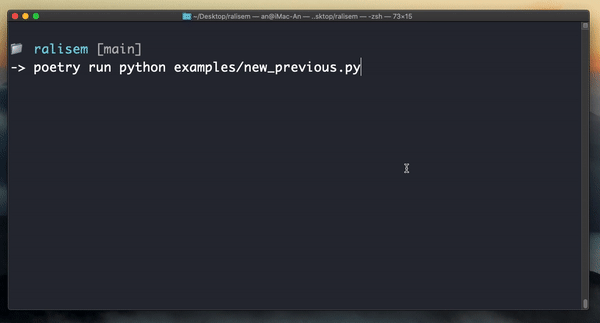
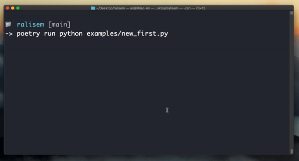

# Rate Limit Semaphore
> Rate limit semaphore for async-style (any core)


[](https://coveralls.io/github/deknowny/rate-limit-semaphore?branch=main)
***
There are two implementations of rate limit semaphore. Live demo shows how [FixedNewPreviousDelaySemaphore](./examples/new_previous.py) and [FixedNewFirstDelaySemaphore](./examples/new_first.py) work
***




## Overview
```python
import datetime
import ralisem

# Or another implementation
sem = ralisem.FixedNewPreviousDelaySemaphore(
    access_times=3, per=datetime.timedelta(seconds=1)
)
async with sem:
    ...
```
Difference:
* `FixedNewPreviousDelaySemaphore`: Sures the last and a new access have a fixed required delay (`per / access_times`)
* `FixedNewFirstDelaySemaphore`: Sures first and last in series (serias is `access_times`) have a fixed delay (`per`)

## Methods
All of these implementations are inherited from one base `TimeRateLimitSemaphoreBase`. Check out full methods [here](./ralisem/base.py)

# Installation
Via PyPI:
```shell
python -m pip install ralisem
```
Or via GitHub
```shell
python -m pip install https://github.com/deknowny/rate-limit-semaphore/archive/main.zip
```
# Contributing
Check out [Contributing section](./CONTRIBUTING.md)
